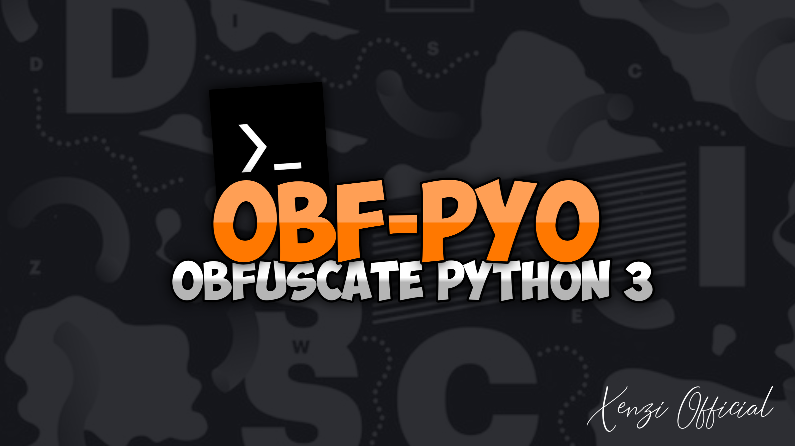
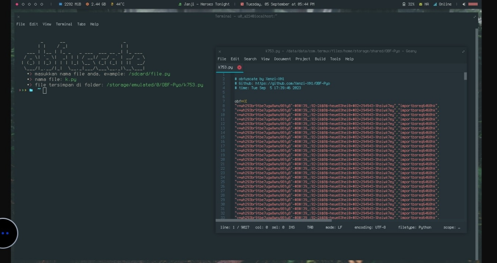

<div align="center">
  
  <br>
  <br>
  <p>
    
    
    
  </p>
  <h4> obfuscate python 3 </h4>
</div>

### Apa itu OBF-Pyo?
[**OBF-Pyo**](https://github.com/Xenzi-XN1/OBF-Pyo) adalah sebuah tools obfuscate/encode python 3 yang berfungsi untuk menjaga `keamanan` script/tools anda.

### Termux command?
```python
$ apt update && apt upgrade
$ pkg install git
$ pkg install python
$ termux-setup-storage
$ git clone https://github.com/Xenzi-XN1/OBF-Pyo
$ cd OBF-Pyo
$ pip install requests
$ pip install bs4
$ python run.py
```

### cara obfuscate/encode script anda?
- masukan nama file yang inggin di obfuscate/encode, contoh file anda di internet (`/sdcard/namafile.py`) `Termux`.
- tunggu obfuscate/encode selesai, contoh obfuscate/encode anda selesai ada pesan (`file tersimpan di folder: /sdcard/OBF-Pyo/namafile.py.
- file yang sudah di obfuscate/encode tersimpan di folder /sdcard/OBF-Pyo


### terimakasih kepada team?
 - `Team-Xenzi`,`XTC-Code`,`XNX-Code`
